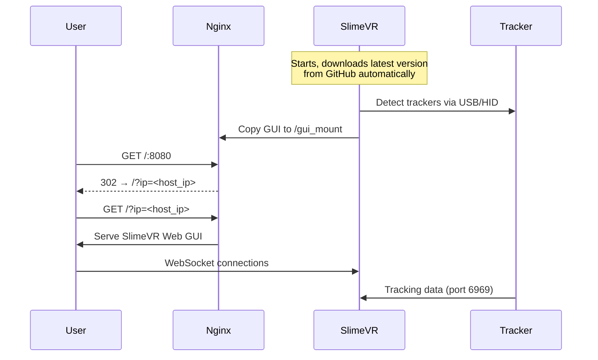

# SlimeVR Docker

Run [SlimeVR Server](https://github.com/SlimeVR/SlimeVR-Server) + Web GUI in Docker.

## Quick Start

```bash
docker compose up -d --build
open http://localhost:8080
```

Stop:
```bash
docker compose down
```

## What it does



## Architecture

| Container | Purpose | Network |
|-----------|---------|---------|
| `slimevr` | Java server + tracker comms | bridge (port mapped) |
| `nginx` | Serves Web GUI | bridge (port mapped) |

Healthchecks:
- `slimevr`: validates the Java process is running
- `nginx`: validates local HTTP response on `127.0.0.1:${WEBGUI_PORT}`

- **slimevr**: Downloads latest SlimeVR from GitHub, copies GUI to volume
- **nginx**: Serves GUI, auto-redirects with `?ip=` parameter for WebSocket connection

## Configuration

Create `.env` if you need custom values (all optional):

```env
WEBGUI_PORT=8080
SLIMEVR_VERSION=latest
# Optional: serial group id for /dev/ttyACM* access
# On Arch this is typically 984 (uucp)
SERIAL_GID=984
```

Without `.env`, defaults are used (port `8080`, latest version).

## Volumes

| Volume | Purpose |
|--------|---------|
| `slimevr-config` | Persists SlimeVR config in `/home/ubuntu/.config/dev.slimevr.SlimeVR` |
| `slimevr-gui` | GUI assets (slimevr → nginx) |

## Ports

| Port | Protocol | Purpose |
|------|----------|---------|
| 6969 | UDP | Tracker data |
| 8080 | TCP | Web GUI |
| 21110 | TCP | WebSocket VR Bridge |
| 9000-9002 | TCP/UDP | OSC |
| 39539-39540 | TCP/UDP | VMC |

## Update

```bash
docker compose up -d --build
```

Always downloads latest unless you set `SLIMEVR_VERSION` in `.env`.

## Device Access

SlimeVR needs access to USB HID devices (`/dev/hidraw*` and `/dev/ttyACM*`) to communicate with trackers. The container handles this automatically:

1. **Entrypoint** (`slimevr/entrypoint.sh`) runs as root at startup and sets permissions to `660` / group `dialout` on all `/dev/hidraw*` devices.
2. **Background watcher** polls every 2 seconds to fix permissions on newly hotplugged devices. It also detects USB disconnect/reconnect cycles and restarts the Java process cleanly (SlimeVR's HID manager throws `NullPointerException` on hotplug).

No manual udev rules or permission changes are needed on the host.

### Group configuration

The container drops privileges to user `ubuntu` (UID 1000) and is added to the `dialout` and `video` groups. If your distro uses a different serial group (e.g. Arch uses `uucp`), add the GID in `.env`:

```env
SERIAL_GID=984    # Arch: uucp
```

Then uncomment `SERIAL_GID` in `docker-compose.yml` under `group_add`.

### Windows (WSL2)

Docker Desktop on WSL2 does **not** expose USB devices by default. You need [usbipd-win](https://github.com/dorssel/usbipd-win) to attach USB devices to WSL2:

```powershell
# Windows (Admin PowerShell)
usbipd bind --busid <BUSID>
usbipd attach --wsl --busid <BUSID>
```

When you detach and re-attach a device via usbipd, the background watcher inside the container will automatically restore connectivity.

## Management

A convenience script is provided for common operations:

```bash
./slimevrctl up       # Build and start in background
./slimevrctl down     # Stop and remove containers
./slimevrctl restart  # Restart (down + up)
./slimevrctl logs     # Follow logs
./slimevrctl status   # Show container status
./slimevrctl doctor   # Diagnostics (serial, groups, logs)
```

### Diagnostics

Run `./slimevrctl doctor` to check device visibility inside the container.

## Troubleshooting

### Error: `failed to add ... veth ... operation not supported`

If your Docker host/kernel does not support creating the default bridge/veth pair,
the one-shot `slimevr-init` container can fail before startup. This project sets
`network_mode: none` for that init container because it only prepares volumes and
does not need network access.

If you still hit this error, make sure your local `docker-compose.yml` includes:

```yaml
services:
  slimevr-init:
    network_mode: none
```

```bash
# Check status
docker compose ps

# View logs
docker compose logs -f

# Full diagnostics
./slimevrctl doctor
```

### Error: tracker detected then lost after USB reconnect

SlimeVR's HID manager cannot gracefully handle device removal/re-attachment. The background watcher in `entrypoint.sh` detects hotplug cycles and automatically restarts the container. If the automatic restart does not trigger (e.g. due to timing), run:

```bash
docker compose restart slimevr
```

## Credits

- [SlimeVR](https://slimevr.dev/)
- GUI from official [SlimeVR releases](https://github.com/SlimeVR/SlimeVR-Server/releases)

## License

MIT
