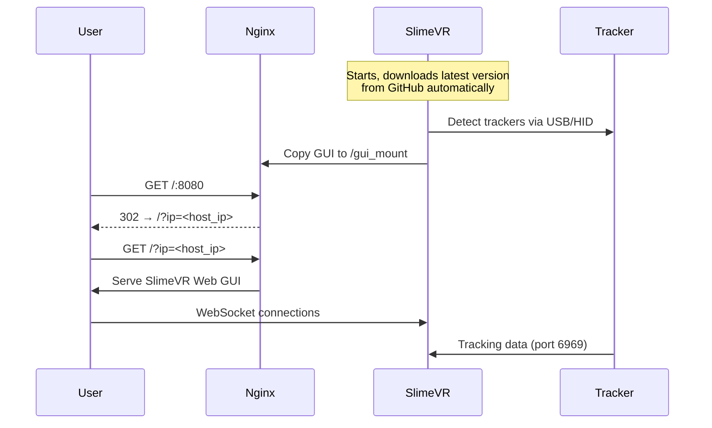

# SlimeVR Docker

Run [SlimeVR Server](https://github.com/SlimeVR/SlimeVR-Server) + Web GUI in Docker.

## Quick Start

```bash
docker compose up -d --build
open http://localhost:8080
```

Stop:
```bash
docker compose down
```

## What it does



## Architecture

| Container | Purpose | Network |
|-----------|---------|---------|
| `slimevr` | Java server + tracker comms | host |
| `nginx` | Serves Web GUI | host |

- **slimevr**: Downloads latest SlimeVR from GitHub, copies GUI to volume
- **nginx**: Serves GUI, auto-redirects with `?ip=` parameter for WebSocket connection

## Configuration

Create `.env` if you need custom values (all optional):

```env
WEBGUI_PORT=8080
SLIMEVR_VERSION=latest
```

Without `.env`, defaults are used (port `8080`, latest version).

## Volumes

| Volume | Purpose |
|--------|---------|
| `slimevr-config` | Persists `vrconfig.yml` |
| `slimevr-gui` | GUI assets (slimevr → nginx) |

## Ports

| Port | Protocol | Purpose |
|------|----------|---------|
| 6969 | UDP | Tracker data |
| 8080 | TCP | Web GUI |
| 21110 | TCP | WebSocket VR Bridge |
| 9000-9002 | TCP/UDP | OSC |
| 39539-39540 | TCP/UDP | VMC |

## Update

```bash
docker compose up -d --build
```

Always downloads latest unless you set `SLIMEVR_VERSION` in `.env`.

## Troubleshooting

```bash
# Check status
docker compose ps

# View logs
docker compose logs -f

# Full diagnostics
./slimevrctl doctor
```

## Credits

- [SlimeVR](https://slimevr.dev/)
- GUI from official [SlimeVR releases](https://github.com/SlimeVR/SlimeVR-Server/releases)

## License

MIT